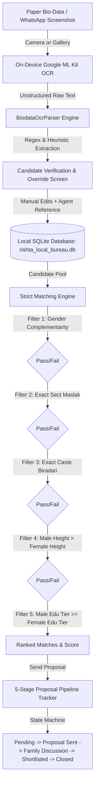

# NikahBureau Pro — 100% Offline Muslim Marriage Bureau Android App

A specialized, completely offline, zero-backend Android application (`.apk`) built for Muslim marriage agents ("Rishta / Marriage Bureaus") to manage candidate profiles, auto-scan physical bio-data sheets via on-device AI/OCR, enforce strict matrimonial compatibility rules, and track match pipelines locally on their phone.

---

## 1. System Architecture



### Key Technical Highlights
- **100% Offline & Private**: Zero external cloud APIs, no Firebase backend, no remote databases. Candidate photos and biodata sheets remain strictly sandboxed inside Android internal storage (`/data/user/0/com.nikahbureau.rishta_agent_app/app_flutter/`).
- **On-Device OCR**: Runs Google ML Kit Text Recognition embedded directly in the `.apk`.
- **Instant `.apk` Distribution**: Compiles to a direct shareable APK ready to send to bureaus or agents over WhatsApp.

---

## 2. Database Schema (SQLite)

Located in `lib/database/app_database.dart`:

### Table: `candidates`
| Column | Type | Constraints | Description |
|---|---|---|---|
| `id` | TEXT | PRIMARY KEY | UUID v4 |
| `name` | TEXT | NOT NULL | Candidate's full name |
| `gender` | TEXT | NOT NULL | `'Male'` or `'Female'` |
| `age` | INTEGER | NOT NULL | Age in years |
| `height_inches` | REAL | NOT NULL | Total inches (e.g. 5'10" = 70.0) |
| `height_display` | TEXT | NOT NULL | Formatted string (e.g. `5' 10"`) |
| `weight_kg` | REAL | NOT NULL | Weight in kilograms |
| `education` | TEXT | NOT NULL | Degree title (e.g. `MS Computer Science`) |
| `education_tier` | INTEGER | NOT NULL | Hierarchy rank (0 to 6) |
| `sect` | TEXT | NOT NULL | Maslak (`Barelvi`, `Deobandi`, `Ahle Hadith`, etc.) |
| `caste` | TEXT | NOT NULL | Biradari (`Sheikh`, `Syed`, `Rajput`, `Ansari`, etc.) |
| `city` | TEXT | NOT NULL | Current city of residence |
| `contact_number` | TEXT | NOT NULL | Phone / WhatsApp |
| `agent_reference_name` | TEXT | NOT NULL | Submitting agent / bureau reference |
| `photo_path` | TEXT | NULLABLE | Local file path |
| `biodata_image_path` | TEXT | NULLABLE | Local sandboxed scan document path |
| `pipeline_status` | TEXT | NOT NULL | Current pipeline stage key |
| `notes` | TEXT | NULLABLE | Agent private comments / family terms |
| `created_at` | TEXT | NOT NULL | ISO 8601 string |
| `updated_at` | TEXT | NOT NULL | ISO 8601 string |

*Index: `CREATE INDEX idx_candidates_gender_sect_caste ON candidates(gender, sect, caste)` for sub-millisecond match query speed.*

### Table: `proposals`
Links two candidates into an active matchmaking pipeline:
- `id`, `male_candidate_id`, `female_candidate_id`, `male_name`, `female_name`, `sect`, `caste`, `stage`, `notes`, `created_at`, `updated_at`.

### Table: `status_history`
Tracks audit trail of family discussions, meetings, and state changes:
- `id`, `proposal_id`, `previous_stage`, `new_stage`, `note`, `timestamp`.

---

## 3. Automated Bio-Data OCR Scanner (`BiodataOcrParser`)

Extracts unstructured text from paper biodata sheets or mobile screenshots:
1. **Name Extraction**: Detects labels (`Name:`, `Candidate Name:`, `Biodata of:`) and falls back to top title heuristics.
2. **Height Normalization**: Converts multi-format inputs (`5'8"`, `5 ft 7 in`, `5.6`, `172 cm`) into exact floating-point inches (`heightInches`) for mathematical comparison.
3. **Education Hierarchical Classifier**: Maps raw degree text into normalized tiers:
   - **Tier 6**: Doctorate / PhD
   - **Tier 5**: Masters / Post-Grad (MS, MBA, MBBS, MD, CA, ACCA, FCPS, M.Tech)
   - **Tier 4**: Bachelors / Graduate (BS, B.Tech, B.Com, BA, BSc, BBA, LLB, BE, BDS)
   - **Tier 3**: Associate Degree / 3-Year Polytechnic Diploma / DAE
   - **Tier 2**: Intermediate / High School / 12th / A-Levels / FSc / ICS / FA
   - **Tier 1**: Matriculation / 10th / O-Levels / Secondary
   - **Tier 0**: Unspecified / Below Matric
4. **Sect (Maslak) Recognition**: Recognizes `Tablighi`, `Ahle Hadith`, `Barelvi`, `Deobandi`, `Sunni / Hanafi`, `Shia`.
5. **Caste (Biradari) Recognition**: Recognizes `Sheikh`, `Syed`, `Rajput`, `Arain`, `Ansari`, `Memon`, `Gujjar`, `Malik`, `Mughal`, `Qureshi`, `Khan/Pathan`, `Siddiqui`, etc.
6. **Agent Reference Field**: Captures submitting agent/bureau source.

---

## 4. Strict Matrimonial Matching Algorithm (`MatchingEngine`)

When an agent presses **"Find Matches"**, the engine applies 4 non-negotiable rules:

$$\text{Match} = (\text{Gender}_{\text{Male}} \iff \text{Gender}_{\text{Female}}) \land (\text{Sect}_A = \text{Sect}_B) \land (\text{Caste}_A = \text{Caste}_B) \land (H_{\text{Groom}} > H_{\text{Bride}}) \land (E_{\text{Groom}} \ge E_{\text{Bride}})$$

1. **Gender Complementarity**: Male matches only with Female.
2. **Sect (Maslak) Compatibility**: Strict exact string match.
3. **Caste (Biradari) Compatibility**: Strict exact string match.
4. **Height Constraint**: Male's height must be **strictly greater** than the Female's height ($H_{\text{Male}} > H_{\text{Female}}$).
5. **Educational Hierarchy**: Male's education tier must be **equal to or higher** than Female's tier ($E_{\text{Male}} \ge E_{\text{Female}}$).

### Secondary Compatibility Scoring (0–100%):
- **Age Difference (+25 pts)**: Optimal cultural gap (Groom 1–4 years older than Bride).
- **Geographic Proximity (+15 pts)**: Same city.
- **Intellectual Alignment (+10 pts)**: Identical or adjacent educational tiers.

---

## 5. Status Tracking Pipeline

Proposals and profiles advance through 5 distinct operational stages:
1. 🟡 **Pending Review**: Freshly scanned biodata sheet; awaiting agent phone verification.
2. 🔵 **In Progress / Proposal Sent**: Profile and details dispatched to the opposing family.
3. 🟣 **Family Discussion**: Families reviewing photos, horoscope/terms, or holding in-person meetings.
4. 🟢 **Accepted / Shortlisted**: Both parties consented to proceed towards engagement/Nikah.
5. 🔴 **Declined / Closed**: Proposal rejected by either family or candidate withdrawn.

---

## 6. How to Build the Standalone Shareable `.apk`

### Prerequisites
- Flutter SDK (3.x or higher)
- Android Studio / Android SDK (API 34)
- Java 17 or JDK 11

### Step 1: Fetch Dependencies
Navigate to the project root and run:
```bash
cd rishta_agent_app
flutter pub get
```

### Step 2: Build the Release APK

#### Option A: Lightweight Split-Per-ABI APKs (Recommended for WhatsApp sharing: ~25 MB)
```bash
flutter build apk --release --split-per-abi
```
Generated APK files:
- `build/app/outputs/flutter-apk/app-arm64-v8a-release.apk` (For 95% of modern Android phones)
- `build/app/outputs/flutter-apk/app-armeabi-v7a-release.apk` (For older 32-bit Android phones)

#### Option B: Universal All-in-One APK (~50 MB)
```bash
flutter build apk --release
```
Generated file:
- `build/app/outputs/flutter-apk/app-release.apk`

### Step 3: Distribute to Bureau Agents
1. Open WhatsApp or Telegram on your computer or phone.
2. Drag and drop `app-arm64-v8a-release.apk` or `app-release.apk` directly into the chat with the marriage agent.
3. The agent taps the APK on their Android device, taps **Install**, and the application runs immediately without requiring Google Play Store!
